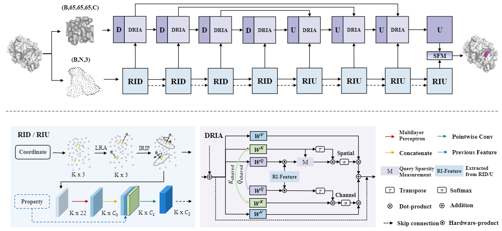

# DRIVPocket: A Dual-stream Rotation Invariance in Feature Sampling and Voxel Fusion Approach for Protein Binding Site Prediction

This repository contains the source code, trained models and the test sets for DRIVPokect.

## Introduction

The prediction of protein binding sites is a critical step in drug design. However, the task is challenging due to the small size of the binding sites and the significant variation in size between different proteins. To address these issues, we propose a novel protein binding site prediction model called DRIVPocket, based on dual-stream rotational invariance and voxel feature fusion. Remarkably, DRIVPocket can simultaneously predict the entire pocket region and the atoms near the cavity.

Specifically, we first represent the protein in two modalities, voxel and point cloud, and extract the relevant features via Dual Rotational Invariance Attention (DRIA) feature extraction and Rotational Invariance Down-Up (RID/RIU) sampling modules, respectively. We also fuse the point cloud features into voxel features through DRIA, which is based on shared channel attention and spatial attention. By design, DRIVPocket can better understand the chemical properties and structural features of the protein according to the fusion features.Additionally, DRIVPocket predicts the binding regions and binding atoms from the voxel features and the point cloud features, respectively. Finally, a more accurate segmentation prediction is obtained by integrating the two predictions.

Experiments show that DRIVPokcet improves by 5% on DVO and 1%-4% DCA Top-n prediction compared with previous state-of-the-art methods on four benchmark data sets.


## Requirements
[Fpocket](https://github.com/Discngine/fpocket), [Pytorch](https://pytorch.org/), [libmolgrid](https://github.com/gnina/libmolgrid), [Biopython](https://biopython.org/) and other frequently used python packages

To reproduce the substructure benchmark [Prody](https://prody.csb.pitt.edu/) and [Rdkit](https://www.rdkit.org/) are also required.
## Datasets
Train data: Train dataset scPDB can be downloaded from here (http://bioinfo-pharma.u-strasbg.fr/scPDB/).

Test data: Test datasets can be downloaded according to the following links, COACH420 (https://github.com/rdk/p2rank-datasets/tree/master/coach420), HOLO4k (https://github.com/rdk/p2rank-datasets/tree/master/holo4k), SC6K (https://github.com/devalab/DeepPocket), PDBbind (http://www.pdbbind.org.cn/download.php). 

You can make your own preprocessed data by referring to [DeepPokcet](https://github.com/devalab/DeepPocket).Also, You can download our pre-processed train and test data DRIVPocket/dataset from Baidu Cloud Disk (https://pan.baidu.com/s/12VfiR7vfjhXsoxseShdKCA code: zqk9).

## Train
If you want to train DRIVPocket by yourself, we provide the dataparallel and distribute code. Additionly, we use [wandb](https://wandb.ai/site) to track training performance. It's free and easy to use. If you want to avoid using wandb, simply use '--usewandb 0' to disable the use of wandb.

You can use the command to train your model in data parallel.
```
 python train_dataparallel.py -b 20 -o ./model_saves/seg_train -e 150 -r seg_train -d scPDB --train_recmolcache scPDB_new.molcache2 --test_recmolcache scPDB_new.molcache2

```

Also, we provide a command for distribute mode.
```
  torchrun --nproc_per_node=4 train_distribute.py -b 5 -o ./model_saves/seg_train -e 150 -r seg_train -d scPDB --train_recmolcache scPDB_new.molcache2 --test_recmolcache scPDB_new.molcache2
```

## Test
#### 1. Pre-trained model
You can download our pretrained model in [here](https://pan.baidu.com/s/12VfiR7vfjhXsoxseShdKCA), code: zqk9.

#### 2. Evaluation
To test DRIVPocket on COACH420 in terms of DCC and DVO, run the following command:

```
python test.py --test_set coach420 --DATA_ROOT coach420 --model_path checkpoint.pth.tar
```

To test DRIVPocket on COACH420 in terms of DCA top-n, run the following command:

```
python test.py --test_set coach420 --is_dca 1 --rank 0 --DATA_ROOT coach420 --model_path checkpoint.pth.tar
```

To test DRIVPocket on COACH420 in terms of DCA top-n+2, run the following command:

```
python test.py --test_set coach420 --is_dca 1 --rank 2 --DATA_ROOT coach420 --model_path checkpoint.pth.tar
```


